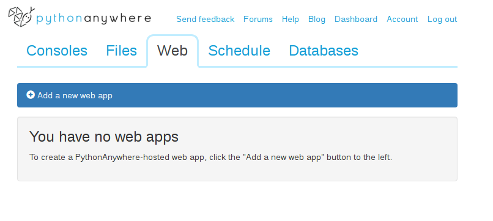

# Installation - Pythonanywhere server backend

## 1. Your pythonanywhere account

Sign up for a free account at [pythonanywhere](https://www.pythonanywhere.com). Note your username (case sensitive).

## 2. Download fanekart

In your browser, open a bash console (in "console" tab, click on "bash")


In the console, type

```
cd

git clone https://github.com/LtGlahn/fanekart
```

This will download all nescessary files to the home directory of your PythonAnywhere account.

## 3. Get your flask web app running.

Get your flask web app up and running at your pythonanywhere installation. Click the "Web" tab, then the "add a new web app" button.



Click at the **Flask** option at the choice **"Select a python web framework"**. Otherwise go with the defaults.

Congratulations! Your new website at the adress https://<yourPAusername.pythonanywhere.com  should now welcome you with  a "Hello from Flask" - greeting!


### 3.1. Serve static files

A flask web app will create content dynamically, on the fly, whereas static files (html, css, javascript) are, well, files living in a folder somewhere. It's much more efficient to serve these directly from the file system - but you have to tell Flask where they live.

Scroll down to the **"Static files:"** section.

Your settings should be
```
URL: /fanekart/
Directory: /home/<yourPytonanywereUsername>/fanekart/webmap/
```

In the example below, my pythonanywhere username is *JanFreeBeer* (note: Case sensitive!)


Hit **Reload web app**.

Your map should appear live on the adress https://<yourPAusername.pythonanywhere.com/fanekart/ (but you still need to configure the map a bit, see section XXX)

### 3.2

### 4. Configure the map


### 5. Your tracker.


